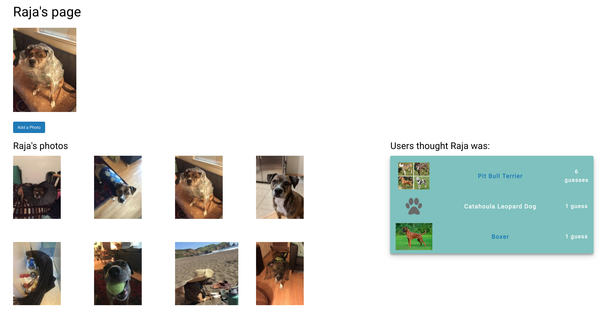

# MuttWhat
#### A social app for sharing dogs and guessing breeds

[MuttWhat on heroku](https://muttwhat.herokuapp.com/) (please excuse initial load time, it's currently on their free service)

#### MuttHow:

Flip through the carousel of mutt photos and make guesses from a dropdown of breeds. What sorts of dogs could have beget this mutt? A list of top guesses is available, but hidden by default. Click on the mutt to go to his/her profile page, where you can see any other pics the owner posted, and see the full list of guesses.

If you'd like to share a mutt (or several), you can sign up, create a profile for each and post pictures, then choose one profile pic to go onto the homepage. Purebreds every bit as welcome as wonky mutts! You don't have to sign up to play the guessing game -- 3 guesses max, either way.

#### About the project

I'd like to expand this project to include a page for finding rescue animals. The breed list for the game is obtained from the Petfinder API, so as to be compatible with eventually using the data to link to shelter for a specified location. As a related feature I'd also like to add optional owner info for a dog's profile, as this could be an engaging way for shelters themselves to post pets in need and broadcast their details.

All the breed stock photos and links are scraped from wikipedia, so for some of them, the Petfinder names don't match, and they're without images.

